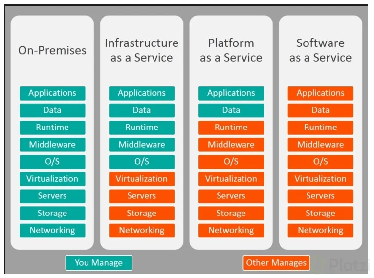
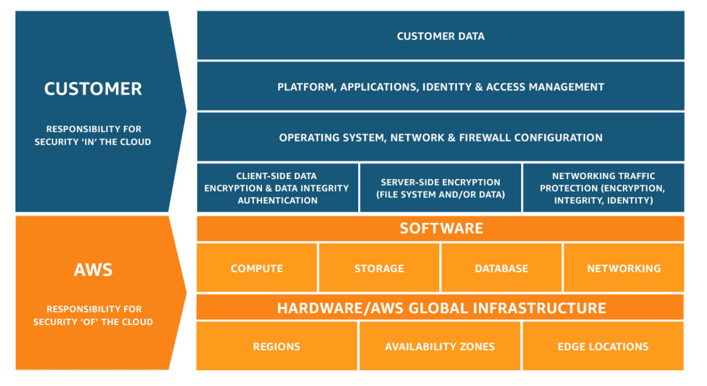

IaaS (Infraestructura como Servicio), 
PaaS (Plataforma como Servicio) y 
SaaS (Software como Servicio) 
son tres modelos de servicio en la nube que ofrecen diferentes niveles de control y responsabilidad a los usuarios sobre la infraestructura, la plataforma y el software. Aquí tienes una descripción breve de cada uno:

IaaS (Infraestructura como Servicio): En IaaS, los proveedores de la nube ofrecen infraestructura virtualizada, como servidores, almacenamiento y redes. Los usuarios pueden crear, configurar y administrar máquinas virtuales y recursos según sus necesidades. Esto brinda un alto nivel de control sobre la configuración y el sistema operativo, pero los usuarios también son responsables de administrar y mantener el software y las aplicaciones en estas máquinas virtuales.
Ejemplo: Amazon EC2, Microsoft Azure Virtual Machines.

PaaS (Plataforma como Servicio): En PaaS, los proveedores ofrecen un entorno de desarrollo y ejecución completo para que los desarrolladores creen, prueben y desplieguen aplicaciones sin preocuparse por la infraestructura subyacente. PaaS proporciona herramientas y servicios para simplificar el proceso de desarrollo y permite centrarse en la codificación y la innovación, mientras el proveedor maneja la administración de servidores y sistemas.
Ejemplo: Google App Engine, Heroku.

SaaS (Software como Servicio): En SaaS, los usuarios acceden a aplicaciones y software a través de la nube sin la necesidad de instalar ni mantener el software localmente. Las aplicaciones están completamente gestionadas por el proveedor de la nube y se entregan a través de un navegador web.
Ejemplo: Google Workspace, Microsoft 365, Salesforce.

