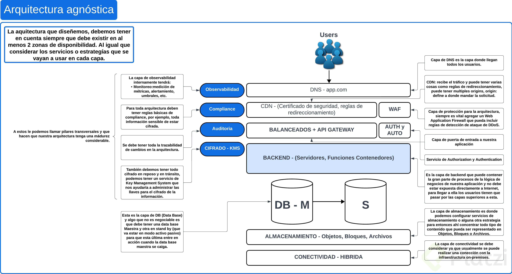

Componentes de la arquitectura agnóstica (distribuida en al menos 2 zonas de disponibilidad):

DNS (platziwallet com): nombre de dominio. Donde llegan todos los usuarios. Reglas de enrutamiento para el dominio¿ Cómo administro el dominio? ¿Dónde va a estar? ¿Lo voy a tener en el CP o en GoDaddy?

CDN(Content Delivery Network): Recibe el tráfico. Puede tener reglas de direccionamiento basado en ciertos criterios y según el origen de los requests. TIene certificado de seguridad (HTTPS) ¿Que CDN voy a utilizar?Cloudflare, Akamai, CloudFront, entre otros.

WAF (Web Application Firewall): Para seguridad y protección. Reglas de denegación de servicio ¿Que WAF voy a tener? Imperva, utilizar el del CP, voy a comprar reglas de OWASP.

BALANCEADOR - API GATEWAY: Puerta de entrada a la app.

AUTENTICACION y AUTORIZACION: Si el usuario está registrado y que permisos tiene. Antes de que el requests llegue a nuestro backend. ¿Que servicio de autenticación voy a usar del mercado?
BACKEND - (Servidores, Funciones o Contenedores): donde está gran parte de nuestra app (microservicios). Zona privada (no acceso directo por internet). ¿ Dónde va a correr nuestro backend?

BASE DE DATOS: DB Master y DB Standby. DB Master: continuamente recibe requests de lectura y escritura. DB Standby: modelo activo- pasivo. Si se cae el DB Master, DB Standby comenzará a recibir los requests¿La DB va a ser relacional o noSql(llave valor o memoria o documentos)? ¿Que motor de BD voy a usar

ALMACENAMIENTO: Objeto, Bloques o Archivos.

CONECTIVIDAD - HÍBRIDA (on-premises): ¿Cómo me conecto? ¿VPN y sacrifico rendimiento?¿Contrato una conexión dedicada con mayor costo?

SERVICIOS TRANSVERSALES:

OBSERVAVILIDAD: Monitoreo (medición de métricas, umbrales, alertamiento) , trazas (el tiempo que se demoran en conectarse los componentes de nuestra aplicación y logs), experiencia de usuario, detección de anomalías del monitoreo,

COMPLIANCE: reglas. Ejemplo: toda la información que se guarde en reposo debe estar cifrada (almacenamiento y db).

AUDITORÍA: Para todos los roles y personas que pueden modificar la arquitectura, tener la trazabilidad de que cambios hizo, cuando los hizo y sobre que componentes de la arquitectura.

CIFRADO - KMS: todo debe estar cifrado en reposo y en tránsito. KMS (Key Management System Service): administración y gestión de llaves.

