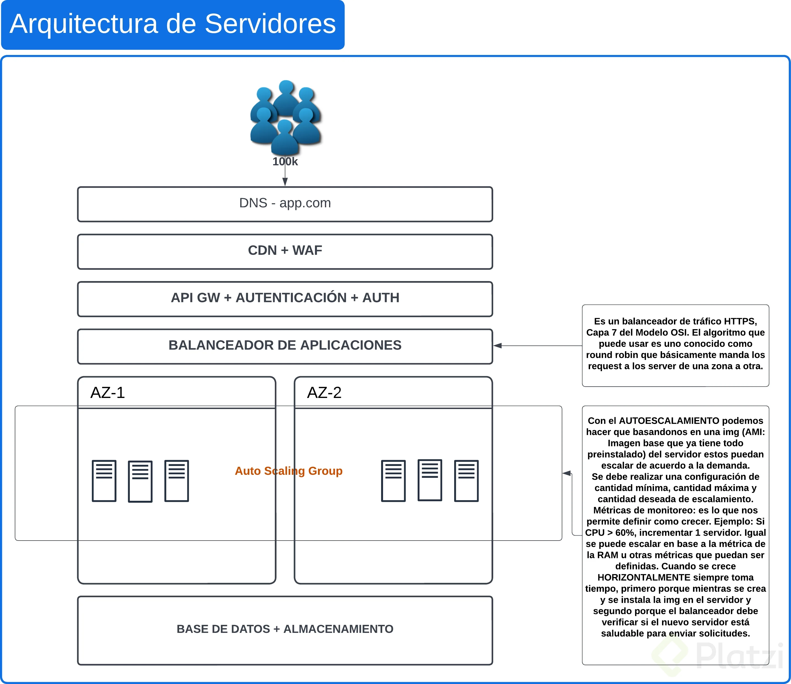

¿Cómo sería nuestra arquitectura si la app corriera completamente basada en servidores?
DIFERENCIAS (balanceador y backend):

Balanceador de aplicaciones: balanceamos tráfico HTTPS. Capa 7 del modelo. El algoritmos del balanceador va a ser un round robin (alterna una y otra zona).

AUTOESCALAMIENTO (autoscaling group): ante más demanda, basándonos en una imagen del servidor (AMI: Imagen base que ya tiene todo preinstalado), estos crecen en cantidad.
Cada servidor nuevo tarda 3 minutos en crearse desde la AMI y hasta que el balanceador determina que está saludable para mandarle tráfico.
La escalabilidad horizontal que no requiere downtime (que la app se caiga). Definir cantidad mínima de servidores para soportar la app, la cantidad deseada y la cantidad máxima.
Debemos definir la cantidad máxima para no crecer indefinidamente y que se nos consuma todo el costo de un mes.

Métricas de monitoreo: para definir cuando comenzamos a crecer en servidores. Ejemplo: cuando la CPU > 60 % sume un servidor y cuando la CPU > 80% sume 2 servidores. También: cuando la CPU % < 60 % reduzca 1 servidor y cuando CPU < 40 % reste 2 servidores. Siempre y cuando no llegue a menos de la capacidad mínima.
Se puede escalar en cualquier parámetro (% CPU, RAM, etc) pero lo mejor es escalar sobre parámetros de demanda. Ejemplo: Cantidad de usuarios.

Tener en cuenta: como escalar, el tiempo de escalamiento y la alta disponibilidad.

