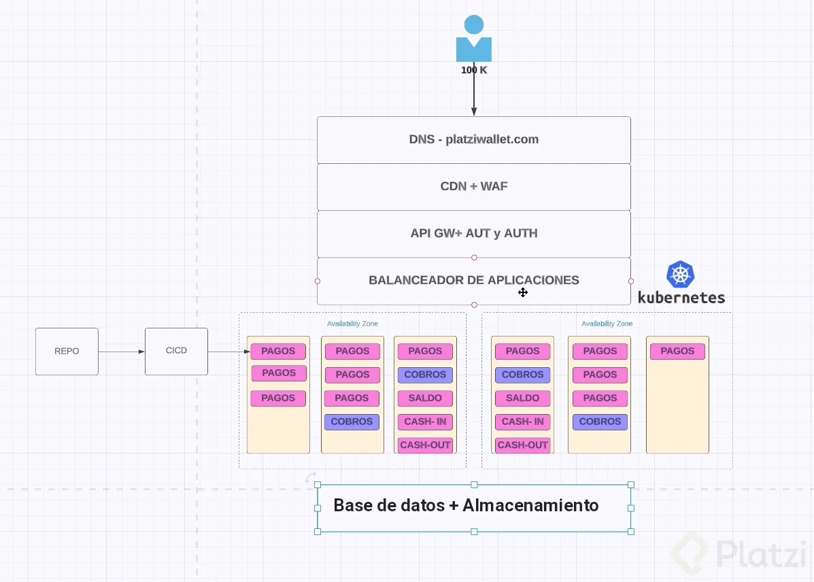

Cuando la app corre en un orquestador de contenedores (nuestro backend corre en contenedores):
DIFERENCIAS (backend). KUBERNETES va a ser el orquestador de los contenedores:
Vamos a tener por lo menos 2 zonas donde en cada zona va a ver al menos 1 servidor. Cada servidor va a tener los contenedores donde van a correr los microservicios.
Ejemplo de microservicios para PlatziWallet: pagos, cobros, saldo, cash-in (consignación), cash-out (retirar), etc.
ESCALAMIENTO: por servidores pero también por microservicios. Porque la escalabilidad del microservicio de cash-in es diferente a la escalabilidad del servicio pagos. Porque se puede ingresar dinero una vez (cash-in) pero realizar 25 pagos.
Tengo 2 tipos de escalabilidad: del servidor y del microservicio (contenedor).

Por SERVIDOR. reglas como: el microservicio de cobros si lo tengo que escalar lo hago en el servidor que tenga disponible menos ram.

Por MICROSERVICIO (servicio de contenedores serverless). El CP se encarga de los servidores. Es más sencillo el escalamiento porque nos enfocamos en el microservicio puntual y no como escalamos los servidores.

CICD: configurar estrategia para llegar a desplegar determinado servicio, versionamiento del microservicio, como lo voy a desplegar, etc.
REPO de código: como va a ser el CICD, que pasos se van a automatizar, qué pruebas le voy a hacer a la imagen.
BASES de DATOS: vamos a usar el STORAGE de los servidores incrementales u otro tipo.
