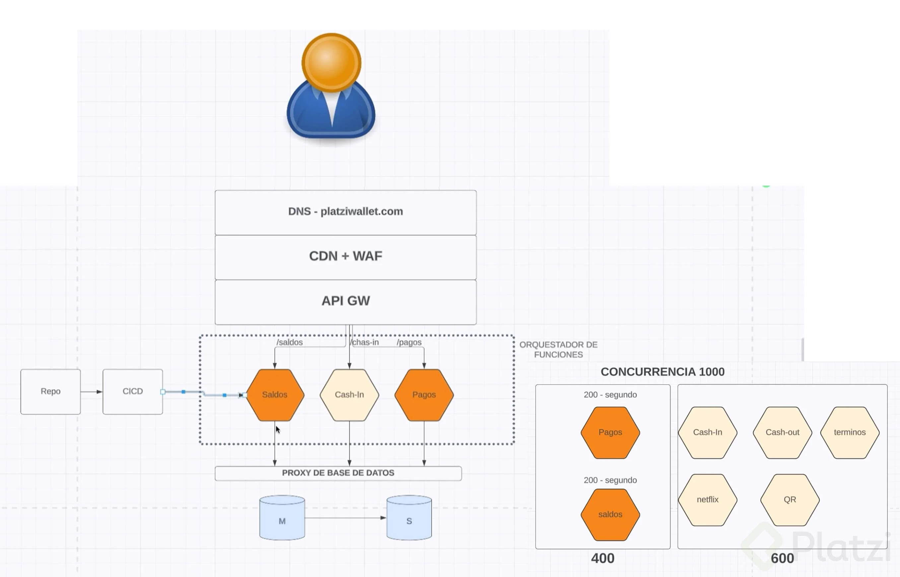

Cómo sería tener muchos de los servicios en funciones:
DIFERENCIAS:

CDN: hay servicios de cdn que pueden tener funciones. Por ejemplo: para cuando venga un requests transformarlo, para hacer un redireccionamiento 301 o 302 (redireccionamiento de dominio temporal o permanente).

FUNCIONES del BACKEND: El API recibe el requests y se lo manda alguna FUNCIÓN. Las reglas del API para la designación de los requests a las funciones sería, por ejemplo: Si la API recibe el request con el pass “/saldos”, le va a mandar ese request a la FUNCIÓN saldos. Entonces para el caso de PlatziWallet tendríamos la funciones de: Saldos, Cash-in, Pagos, entre otras.

BASE de DATOS: 1) No Relacional: La DB será llave-valor y cada FUNCIÓN actualizará determinada tabla en la DB. 2) Relacional: No todas las BD relacionales son serverless. Cuando tenemos múltiples funciones consumiendo una BD relacional puede ser que la cantidad de conexiones se caiga. Entonces para la DB relacional los CP están sacando un PROXY de BD. Estos servicios se encargan de todas las conexiones entre cada FUNCIÓN y la DB. Van a manejar el borrowing (pedir prestado canales de conexión). También, garantizan que si se cae el DB Master, solo se pierda un paquete para cuando empiece a funcionar la DB Standby.
Entonces, las ventajas del PROXY son: 1) seguridad: garantiza que la comunicación siempre sea en TLS. 2) gestión de conexiones 3) mejorar el tiempo de un failover ante una caída de una zona, por ejemplo.

ORQUESTADOR DE FUNCIONES: se encarga de las relaciones entre funciones. Ejemplo de orquestador: en AWS (step Functions), Apache Airflow se usa como orquestador.

ESCALABILIDAD: va a estar dada por los límites de CP. También podemos reservar concurrencia. Por ejemplo: en AWS para todas las funciones la concurrencia es de 1000 ejecuciones por segundo. Entonces en PlatziWallet se puede reservar 200 concurrencias por segundo para las funciones de Pagos y Consulta de Saldo. Es decir 400 concurrencias por segundo para mis funciones más demandadas. Los otros 600 se van a distribuir a medida de que cada uno de los servicios los vaya utilizando.
Por otro lado también se puede hacer un ticket al CP para subir la concurrencia de 1000 a 2000 por ejemplo.

REPO y CICD: hay que ver cómo vamos a desplegar del CICD a la función.

VPC: ¿La función va a correr en una VPC o no? Si es en una VPC hay que tener en cuenta la cantidad de direcciones IP disponibles versus la cantidad de ejecuciones que va a tener esa función para garantizar que tenga IP disponibles.

COLD START: Si la APP no soporta esos segundos iniciales de las funciones podemos pensar en una arquitectura dividida donde tengamos unos servicios en funciones y otros en contenedores. Pues Kubernetes, por ejemplo, no tiene esos segundos iniciales de demora.

    

    